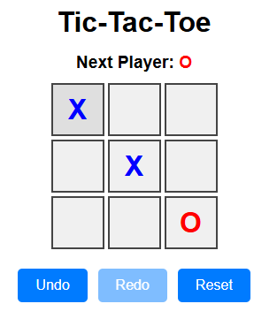

# Tic-Tac-Toe v2

A full stack tic-tac-toe game built with React, Typescript, and Express.

## Prerequisites
- Node.js (v18+)
- npm

## Getting Started

1. Clone the repository:
```bash
git clone https://github.com/outlierSlug/tic-tac-toe-v2.git
cd tic-tac-toe-v2
```

2. Install and run the client (http://localhost:5173):
```bash
cd client
npm install --no-audit
npm run dev
```

3. Install and run the server (http://localhost:8080) in a second terminal:
```bash
cd server
npm install --no-audit
npm run dev
```
4. To stop the client or server, press `Ctrl + C` in the respective terminal.

## Preview


## Gameplay
Get three in a row to win!

Modify gameplay settings with the select options in "Settings". Play locally against a friend or yourself, or play against the computer!

To play against the computer select "Opponent: Computer" and just click a square to start the game as "X". The game will automatically start if you choose to play as "O".

## Special Features
Mode: Endless

Players may only have up to 3 tokens at the board at a time. When a player is about to play a 4th token, the earliest token they placed will be removed.

## License
This project is licensed under the [MIT License](https://mit-license.org/). Feel free to use, modify, and redistribute.